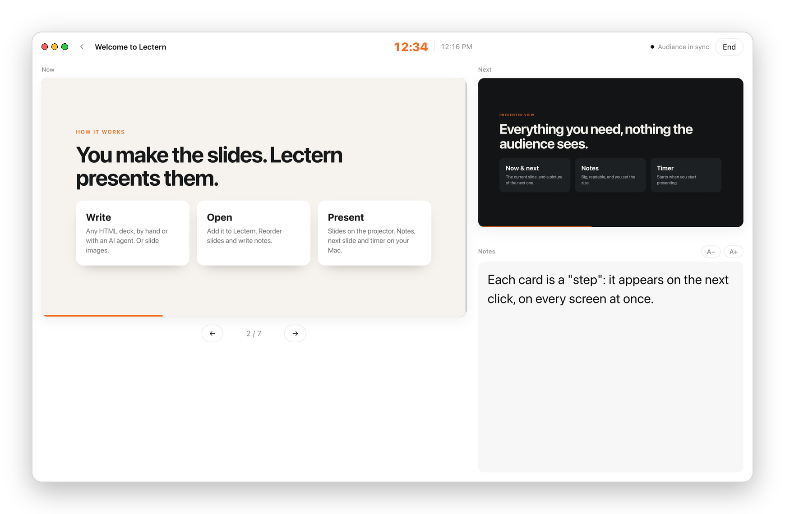
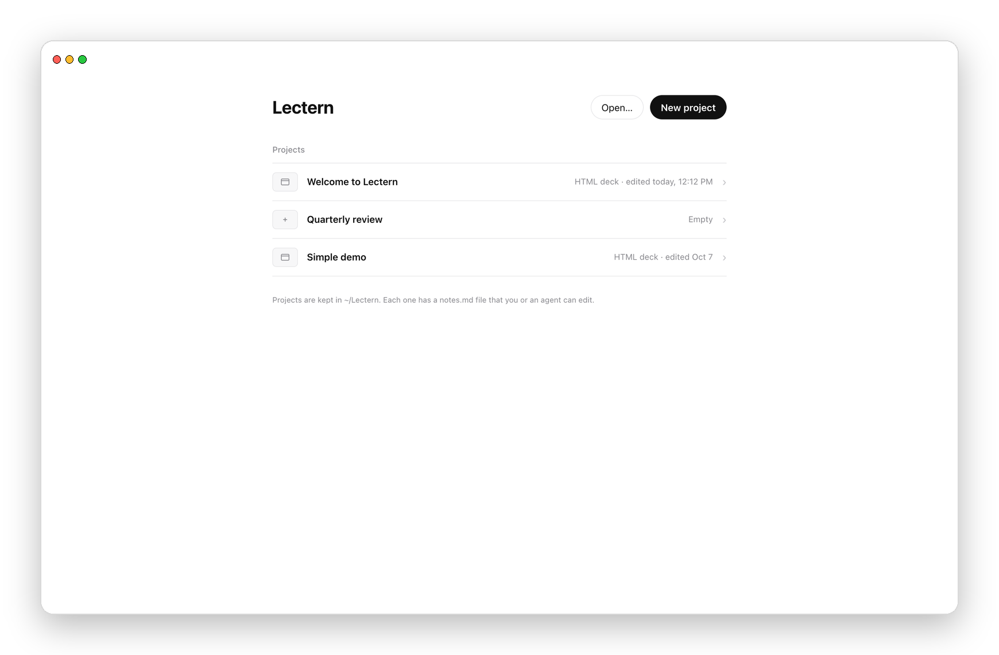
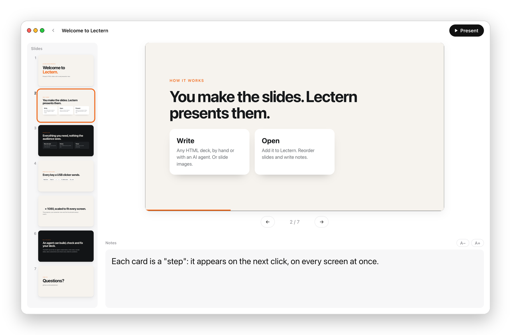
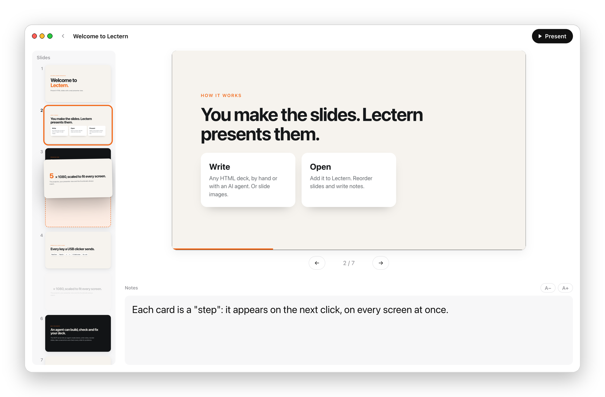
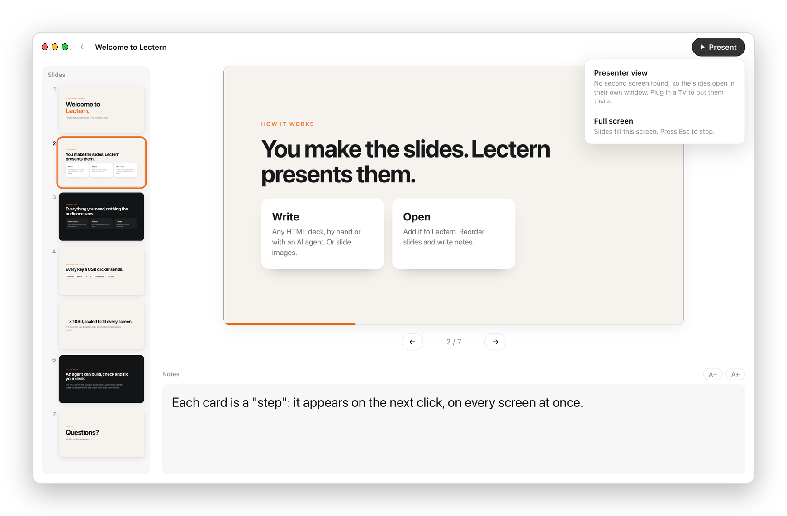
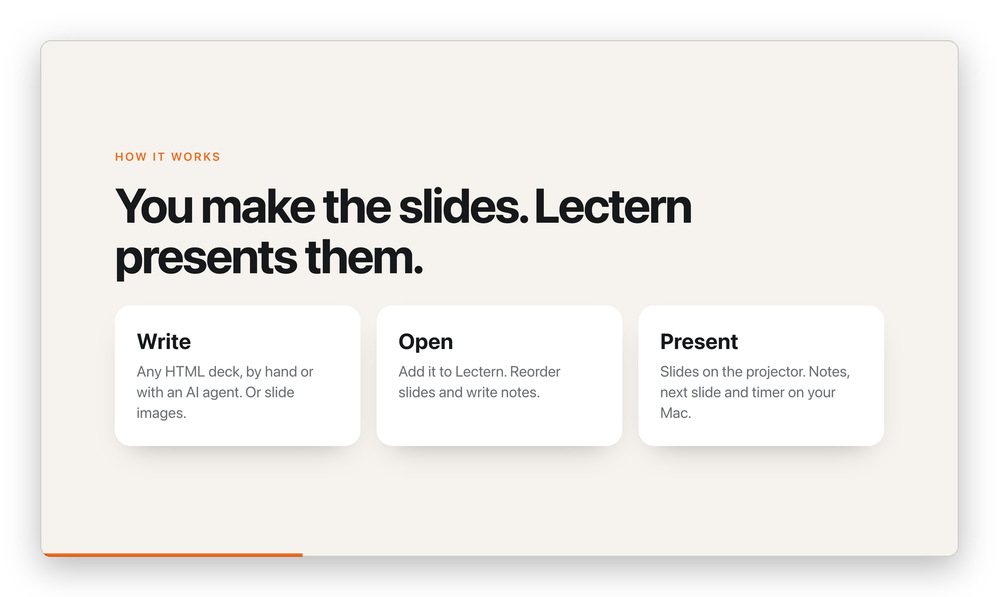

<div align="center">

# Lectern

**Present HTML slides like Keynote: a real presenter view, speaker notes, and a USB clicker, on any Mac.**

You (or an AI agent) make the deck. Lectern presents it.

[](https://github.com/tszaks/lectern/releases/latest/download/Lectern.zip)

[](https://github.com/tszaks/lectern/releases/latest)
[](#install)
[](#install)
[](LICENSE)



</div>

## Why Lectern

HTML is a great way to build slides, especially with AI agents. But a browser tab is a poor way to *present* them: no presenter view, no notes, no next-slide preview, and the slides do not go to the projector by themselves. Keynote and PowerPoint cannot open HTML decks at all.

Lectern is the missing piece. It opens any HTML deck (or a folder of slide images) and gives you what a real presentation app gives you.

- **Presenter view.** The current slide, a picture of the next slide, big speaker notes, and a timer, on your Mac, while the audience sees only the slides.
- **Two screens, no dragging windows.** Lectern finds the TV or projector and puts the slides there full screen. Plug it in late and the slides move there on their own.
- **USB clickers work.** Page Down, Page Up, the arrow keys, and the "blank screen" button.
- **Interactive slides stay in sync.** Click-to-reveal steps, buttons on a slide, even videos play in every view at the same time (muted for you, with sound for the room).
- **Organize without editing.** Reorder slides by dragging their thumbnails. Write notes. Lectern never changes what is on your slides.
- **Built for agents.** Notes are a plain `notes.md` file, decks follow a simple [format](docs/deck-format.md), and an [MCP server](docs/agents.md) lets an AI agent build, check, and fix a deck.
- **Light.** A 1.4 MB native Mac app that uses the Mac's own WebKit. No Electron.

## Install

1. **[Download Lectern.zip](https://github.com/tszaks/lectern/releases/latest/download/Lectern.zip)** (from the [latest release](https://github.com/tszaks/lectern/releases/latest)).
2. Open the zip and drag **Lectern** into your **Applications** folder.
3. Open Lectern.

Lectern is signed and notarized by Apple, so it opens like any other Mac app. It runs on Apple-silicon and Intel Macs with **macOS 12 Monterey or newer**.

Prefer a browser? Lectern also runs with Node.js. See [Other ways to run Lectern](docs/other-ways-to-run.md).

## How it works

### 1. Home: your projects

Open Lectern to your projects. Start a **New project**, **Open…** a deck you already have (an HTML file or a folder), or click a recent project. You can also drop a folder onto the window.



### 2. The project: your slides and notes

Slide thumbnails run down the left. Click one to go to it. The slide shows large, with its notes underneath. Type notes right there; they save on their own. A new project starts empty and asks you to import a deck folder, an HTML file, or slide images.



**Reorder by dragging.** Drag a thumbnail: the slide lifts, a dashed outline shows where it will land, and the other slides move out of the way. Click **Save order** to keep it.



### 3. Present

Click **▶ Present** and choose:

- **Presenter view:** slides full screen on the TV or projector; on your Mac, the current slide, the next slide, your notes, and a timer that starts at 0:00.
- **Full screen:** the slides fill this screen.

Press **Esc** (or **End**) to go back to the project.



| Key | While presenting |
| --- | --- |
| → ↓ Page Down Space | Next slide or step |
| ← ↑ Page Up | Previous |
| B or . | Blank the audience screen (press again to come back) |
| + / − | Bigger or smaller notes |
| Esc | End the presentation |

Lectern can also turn on **Do Not Disturb** while you present (a one-time, two-click setup the first time). See the [user guide](docs/using-lectern.md) for everything else.

## Speaker notes

Write notes in Lectern, or put them in the deck. Either way, only you see them.

```html
<section class="slide">
  <h2>How are you really doing?</h2>
  <aside class="notes">Pause here. Let the room answer before moving on.</aside>
</section>
```

Notes typed in Lectern are saved to a plain **`notes.md`** file in the project, one heading per slide, so a person or an AI agent can read and edit them. See [Speaker notes](docs/speaker-notes.md).

## Make a deck Lectern can present

Any HTML deck you move through with the keyboard works, including decks written by AI agents. ([reveal.js](https://revealjs.com) decks are supported but less tested so far.) The short version:

- each slide is a `<section class="slide">`, and the current one has the class `active`;
- the arrow keys and Page Up / Page Down move through it;
- parts revealed one click at a time have the class `step`;
- notes go in `<aside class="notes">`.

[`examples/welcome`](examples/welcome/index.html) is a complete deck to copy, and [docs/deck-format.md](docs/deck-format.md) is the full contract (written so an AI agent can follow it).



## For AI agents

- **[`llms.txt`](llms.txt)** is a short map of this repo for language models.
- **[docs/deck-format.md](docs/deck-format.md)** tells an agent exactly how to write a deck that works in Lectern.
- **[The MCP server](docs/agents.md)** lets an agent create decks, read the outline, write notes, reorder slides, take screenshots, and run a full check of a deck (content off the slide, broken images, console errors, missing notes).
- Changes to a deck or its `notes.md` show up in an open Lectern window within a few seconds.

## Documentation

| Guide | What it covers |
| --- | --- |
| [Getting started](docs/getting-started.md) | Download, install, first project, first presentation |
| [Using Lectern](docs/using-lectern.md) | Projects, importing, reordering, presenting, two screens, clickers, Do Not Disturb |
| [Speaker notes](docs/speaker-notes.md) | Notes in the deck and in `notes.md` |
| [Deck format](docs/deck-format.md) | How to write a deck Lectern can present (for people and agents) |
| [Agents and MCP](docs/agents.md) | The MCP server and working with AI agents |
| [Other ways to run](docs/other-ways-to-run.md) | In a browser with Node.js, and on a website (for example Vercel) |
| [Troubleshooting](docs/troubleshooting.md) | Common problems and fixes |
| [Architecture](docs/architecture.md) | How Lectern works inside |
| [Contributing](CONTRIBUTING.md) | Building, testing, releasing |

## Build from source

```sh
git clone https://github.com/tszaks/lectern.git && cd lectern
bash mac/build.sh          # builds dist/Lectern.app for this Mac (needs Xcode command line tools)
node bin/lectern.js        # or run it in a browser (Node 18+, no dependencies)
```

## License

[MIT](LICENSE). Made by [Tyler Szakacs](https://github.com/tszaks).
